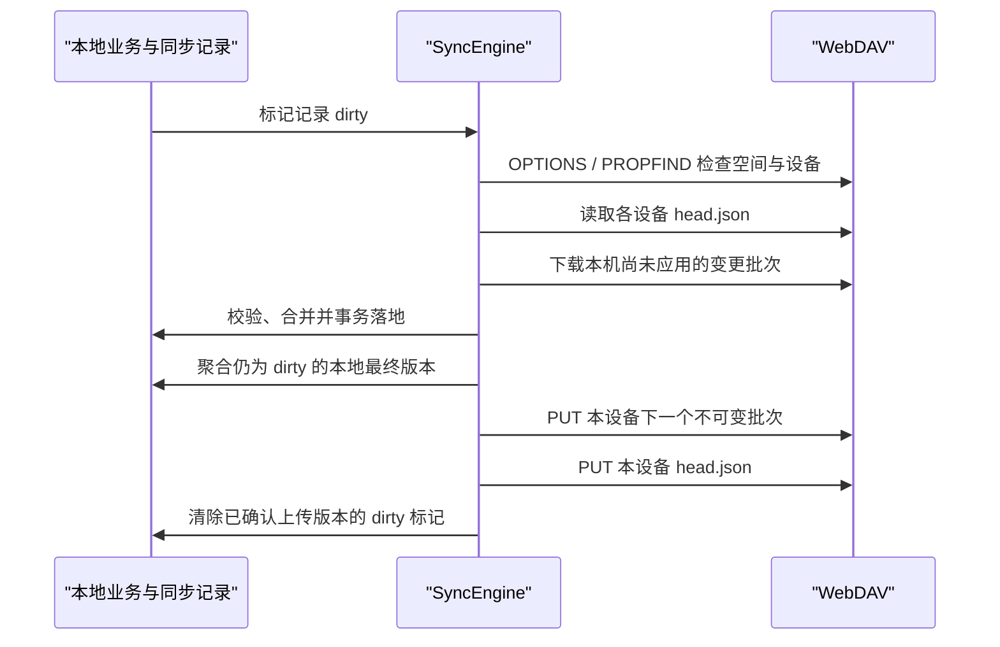

# WebDAV 同步设计

> 状态：核心协议已实现
>
> 日期：2026-07-22
>
> 适用目标：Open Reading 2.x 之后的跨设备同步

## 1. 结论

推荐实现“本地优先、设备独立日志、记录级合并”的 WebDAV 同步，而不是上传整个 SQLite 数据库，也不是让所有设备覆盖同一组 JSON 文件。

每台设备只写自己的远端目录和不可变变更批次。其他设备读取这些批次，在本地按稳定记录 ID、书籍身份和混合逻辑时钟合并。该模型不依赖 WebDAV `LOCK`，不会出现两台设备同时上传时最后写入者覆盖全部远端数据的问题。

当前已实现核心元数据同步，并提供独立、默认关闭的书籍原文件上传能力。原文件不会全量自动上传，需要用户按书选择；当前单文件安全恢复上限为 100 MiB。

## 2. 仓库现状与设计约束

当前持久化分为三类：

1. SQLite：书籍、CanonicalLocator 阅读进度、书签、笔记/高亮、阅读统计和阅读会话。
2. SharedPreferences：应用设置、阅读器设置、自定义主题、书源注册列表、在线书源阅读进度等。
3. 应用管理文件：本地书籍、封面、书内图片、自定义字体、阅读背景和缓存。

现有模型不能直接跨设备复制：

- `books.id`、`bookmarks.id`、`book_notes.id` 是设备本地自增 ID。
- `filePath`、`cover_image_path`、Android SAF locator 等是设备私有位置。
- `currentPage`、`last_rendered_locator` 和分页缓存依赖当前排版与视口。
- 书签没有更新时间和删除记录；物理删除后无法通知其他设备。
- 阅读统计若按“每天取最大值”合并，会丢失两台设备分别产生的阅读时长。
- 设置分散在多个存储器，不能安全地把全部 SharedPreferences 原样上传。

Git 历史中的旧 WebDAV 实现采用“先上传本机全量 JSON，再下载远端”的顺序，并把密码保存到 SharedPreferences。该实现还使用本地数字 ID 和设备路径参与合并，阅读进度倾向取更大页码。这些做法不能作为新实现基础。

## 3. 同步范围

### 3.1 首版默认同步

| 数据域 | 默认 | 合并方式 | 说明 |
| --- | --- | --- | --- |
| 书架元数据 | 开 | 记录级 LWW | 标题、作者、格式、在线书源身份；不含本地路径和缓存 |
| 阅读进度 | 开 | 每书 LWW 寄存器 | 只同步 CanonicalLocator；允许新进度向前或向后移动 |
| 书签 | 开 | 稳定 UUID + LWW + tombstone | 删除必须传播 |
| 笔记/高亮 | 当前关闭 | 稳定 UUID + LWW + tombstone | 保留 `notes` 协议数据集；当前版本不扫描、不上传、不物化到业务表 |
| 阅读会话 | 开 | 只追加集合 | 按会话 UUID 去重后求和，不同步每日派生聚合 |
| 阅读器设置 | 开 | 字段级 LWW | 只同步明确允许的排版、主题和翻页设置 |
| 应用外观设置 | 关 | 字段级 LWW | 语言、系统主题等设备偏好默认留在本机 |
| 书源注册列表 | 待定 | 源 ID 级 LWW + tombstone | 只含公开清单信息和 enabled，不含凭据 |

### 3.2 可选文件同步

- 本地书籍原文件：用户显式开启；按 SHA-256 内容寻址和去重。
- 书籍持久封面：随用户选中的书籍文件上传，独立按 SHA-256 内容寻址；包括书源真实封面和本机生成封面，确保另一台设备恢复后的书架外观一致。
- 自定义字体、阅读背景：单独开关，不能因为同步阅读设置而隐式上传。

### 3.3 永不上传

- WebDAV 密码、AI API Key、书源访问令牌和其他秘密。
- SQLite 文件本身、数据库本地 ID、绝对文件路径、SAF URI、iOS security-scoped URL。
- `cached_content`、`cached_pages`、目录解析缓存、章节缓存、下载队列和临时文件。
- `last_rendered_locator`、`layout_signature`、设备 UI 状态和通知状态。
- 分页缓存、书内图片缓存以及未关联到已选书籍文件的临时封面缓存。

## 4. 稳定身份

### 4.1 书籍身份 `book_uid`

- 本地文件书：启用同步时计算 `sha256:<hex>`。现有 MD5 `contentHash` 可用于首次匹配和迁移，但不作为新远端文件的完整性校验。
- 在线书源书：`source:<source_id>:<source_book_id>`。
- 从在线书源下载为本地文件的书仍优先保留 source 身份，同时记录可选文件 blob。

远端记录从不引用本地 `books.id`。应用同步落地时，通过 `book_uid` 查找或创建本地书籍，再映射为本机数据库 ID。

### 4.2 记录身份

- 书签、笔记、阅读会话在首次进入同步层时生成 UUID v4 `record_id`。
- 阅读进度使用 `book_uid` 作为唯一键。
- 设置使用稳定字段键，例如 `reader.font_id`、`reader.font_size`。
- 旧数据首次启用同步时一次性补齐 UUID，并保证重复执行不会生成新身份。

## 5. 本地同步层

新增 `lib/services/sync/`，建议边界如下：

```text
services/sync/
├─ webdav_client.dart           WebDAV 方法、鉴权、路径和错误归类
├─ sync_engine.dart             单实例同步状态机
├─ sync_change_store.dart       本地同步记录、脏标记、设备游标
├─ sync_clock.dart              HLC 生成、观察与比较
├─ sync_codec.dart              协议 JSON、校验和、版本迁移
├─ sync_scope.dart              数据域开关和平台能力
├─ secure_sync_config.dart      安全凭据与非秘密配置
├─ adapters/
│  ├─ books_sync_adapter.dart
│  ├─ progress_sync_adapter.dart
│  ├─ annotations_sync_adapter.dart
│  ├─ reading_sessions_sync_adapter.dart
│  └─ settings_sync_adapter.dart
└─ models/
   ├─ sync_operation.dart
   ├─ sync_batch.dart
   └─ remote_device_head.dart
```

建议新增本地表：

```sql
CREATE TABLE sync_records(
  dataset TEXT NOT NULL,
  record_id TEXT NOT NULL,
  entity_key TEXT NOT NULL,
  payload_json TEXT,
  hlc TEXT NOT NULL,
  deleted INTEGER NOT NULL DEFAULT 0,
  dirty INTEGER NOT NULL DEFAULT 1,
  PRIMARY KEY(dataset, record_id)
);

CREATE INDEX idx_sync_records_dirty
ON sync_records(dirty, dataset);

CREATE TABLE sync_device_cursors(
  remote_device_id TEXT PRIMARY KEY,
  applied_sequence INTEGER NOT NULL DEFAULT 0,
  updated_at TEXT NOT NULL
);

CREATE TABLE sync_local_state(
  key TEXT PRIMARY KEY,
  value TEXT NOT NULL
);
```

`sync_records` 是协议层的本地镜像，不替代业务表。adapter 负责业务模型与同步记录之间的转换。

远端同步到本机、但本地原文件尚不可用的书籍，不应以空 `filePath` 强行插入现有 `books` 表。首版由书库聚合层把 `sync_records` 中的 `remoteOnly` 书籍投影为“未下载”卡片；当用户下载并通过现有导入服务校验入库后，再建立 `book_uid -> books.id` 映射。在线书源书若对应书源可用，可以直接按 `source_id + source_book_id` 恢复为在线书架项。

对于 SQLite 业务写入，业务记录更新和 `sync_records` 更新必须放在同一个数据库事务中。不能只依靠应用退出时扫描，否则删除和崩溃前的修改会丢失。SharedPreferences 设置使用明确字段白名单，并在同步前做一次当前值对账，修复极少数“设置已写入、脏标记未写入”的崩溃窗口。

## 6. 远端目录协议

默认根目录建议为 `/OpenReading/`，允许用户配置子目录。协议目录固定带版本：

```text
OpenReading/
└─ v1/
   ├─ space.json
   ├─ devices/
   │  └─ <device_id>/
   │     ├─ profile.json
   │     ├─ head.json
   │     └─ changes/
   │        ├─ 000000000001.json
   │        ├─ 000000000002.json
   │        └─ ...
   └─ blobs/
      ├─ books/sha256/ab/<full_hash>
      └─ covers/sha256/ab/<full_hash>
```

### 6.1 `space.json`

```json
{
  "protocol": "open-reading-webdav",
  "schema_version": 1,
  "space_id": "uuid",
  "created_at": "2026-07-22T10:00:00Z",
  "encoding": "json",
  "encryption": "none"
}
```

它只描述同步空间，不保存密码、用户信息或当前全局状态。若目录内存在未知协议或更高主版本，客户端停止写入并提示用户选择其他目录或升级应用。

### 6.2 设备 head

每台设备只覆盖自己的 `head.json`：

```json
{
  "device_id": "uuid",
  "latest_sequence": 42,
  "latest_hlc": "1784714400000-0003-device",
  "updated_at": "2026-07-22T10:00:00Z"
}
```

变更批次必须先成功写入，再更新 head。即使 head 更新失败，下次仍可重试；不能先推进 head 再上传批次。

### 6.3 不可变变更批次

```json
{
  "schema_version": 1,
  "device_id": "uuid",
  "sequence": 42,
  "created_hlc": "1784714400000-0003-device",
  "operations": [
    {
      "dataset": "progress",
      "record_id": "source:demo:book-1",
      "entity_key": "source:demo:book-1",
      "hlc": "1784714400000-0002-device",
      "deleted": false,
      "payload": {"canonical_locator": {}}
    }
  ],
  "sha256": "checksum-of-canonical-payload"
}
```

- 文件名为 12 位补零序号，设备目录保证命名空间隔离。
- 使用 `If-None-Match: *` 创建，若服务器忽略该条件，客户端在写后 GET 并校验内容。
- 单批最多 500 个操作且编码后不超过 1 MiB；超出时拆分。
- 同一未上传记录的多次修改在本地合并，只上传最后版本，避免每次翻页产生一个远端文件。
- 批次不可修改。校验失败时整批拒绝应用并保留错误详情。

## 7. 同步流程



关键顺序是“先拉取并合并，再发布本机最终状态”。如果下载后发现本地记录仍然胜出或合并产生新版本，该版本进入本次上传批次。

同步引擎必须：

- 全局单实例，多个触发合并为一次运行。
- 在每个阶段持久化进度，应用被挂起后可安全重试。
- 元数据请求使用指数退避和抖动；认证失败、证书失败和空间不足不自动无限重试。
- 远端应用和本地业务表更新在事务中完成；任何批次只能在全部落地后推进 cursor。
- 上传成功但本地确认前崩溃时允许重复上传检查，最终保持幂等。

## 8. 冲突规则

### 8.1 时钟

使用 Hybrid Logical Clock（HLC），格式包含物理毫秒、逻辑计数和 device ID。每次本地修改生成新 HLC；每次收到远端 HLC 都更新本地时钟。

比较顺序：物理时间、逻辑计数、device ID。device ID 只用于完全同时的确定性决胜，不代表业务优先级。

HLC 能保证确定性和单设备单调性，但不能凭空修复严重错误的系统时间。客户端应优先参考 WebDAV 响应的 `Date` 头检测时钟偏差；偏差超过 10 分钟时显示警告，超过 24 小时时暂停自动冲突决胜并要求用户校正设备时间。不能静默让一台“未来时间”的设备长期压过其他设备。

### 8.2 阅读进度

- 以最新 HLC 为准，不取最大页码。
- 只同步 CanonicalLocator；接收设备重新分页生成 rendered locator。
- 用户回读、重读或跳回前文是合法行为，不能被“取更大页码”覆盖。
- 阅读器中进度变更防抖 15 秒，并在退出阅读器、应用进入后台前尽力刷新本地同步记录。

### 8.3 书签与预留笔记数据集

- 相同 `record_id` 按 HLC 做 LWW。
- 不同 UUID 即使位置相同也默认保留，避免把用户主动创建的两条不同笔记误判为重复。
- 首次迁移旧书签时，可用 `book_uid + anchor_key/cfi + createDate` 生成确定性 UUID，保证多次迁移幂等。
- 删除写 tombstone，而不是立即从同步层物理删除。首版 tombstone 不自动清理；后续有设备确认水位后再设计压缩。
- 当前只启用书签。`notes` 保持稳定远端名称和适配器实现，但由数据集能力目录标记为不可用；收到未来版本的远端记录时只保存同步镜像，不写入当前业务表。
- 未来启用笔记/高亮时，必须先升级业务 schema，再打开数据集能力，最后迁移用户的同步范围偏好；不得更换 `notes` 远端名称或重新生成已存记录身份。

未来能力启用必须经过固定门禁，避免 UI、协议和业务表在不同版本中失配：

1. 先做向前兼容的业务 schema 迁移，并保证旧版本忽略新增字段后仍能运行。
2. 为保留在 `sync_records` 的远端记录增加幂等回放测试，验证重复启动不会重复插入或改变稳定身份。
3. 再将数据集能力目录标记为支持，使适配器开始扫描本机并物化远端镜像。
4. 最后迁移用户同步范围偏好；既有用户不得因为升级而被静默开启新的敏感数据类型。
5. 若启用后的业务迁移失败，保持协议镜像和远端游标不回退，修复版本可继续回放，不能丢弃未知数据集。

### 8.4 书架元数据

- `filePath`、封面本地路径和缓存字段永不参与冲突。
- 在线书源身份优先于标题/作者匹配。
- 用户可编辑字段按字段 HLC 合并；目前不可编辑字段可以先按整记录 LWW。
- 远端存在书籍元数据但没有本地文件时，书架展示“未下载”占位；不要创建指向不存在路径的普通本地书。

### 8.5 阅读统计

- 同步 `reading_sessions` 事件，不同步 `reading_stats` 每日聚合。
- 每个会话有 UUID；所有设备做集合并集，本地统计页面继续按会话派生日期、时长、页数和书籍数。
- 旧 `reading_stats` 只用于兼容展示。首次启用时可以转换为带 `legacy:<date>:<device_id>` 身份的合成会话，但不能和已有真实会话重复计算；迁移前需写回归测试锁定当前统计语义。

### 8.6 设置

- 使用字段白名单和字段级 HLC，不上传整个 SharedPreferences。
- 默认同步阅读器排版和阅读主题选择。
- 语言、系统深浅色、窗口尺寸、导航显示偏好默认不跨设备。
- 指向本地资源的字体和背景设置只有在对应资源也可用时才应用；否则保留远端选择为“待资源恢复”，本机暂时回退默认。

## 9. 书籍文件同步

书籍文件是独立数据面，不和元数据批次混在一起：

- 默认关闭，按全局开关加单本选择控制。
- 上传前流式计算 SHA-256；远端路径只使用哈希，不使用原始书名。
- 先 `HEAD`/`PROPFIND` 判断 blob 是否存在；存在时校验 size，必要时下载后校验 SHA-256。
- 上传到临时路径，完成后使用 `MOVE` 到最终内容地址；若服务端不支持可靠 MOVE，则直接写唯一临时名并在成功校验后更新元数据引用，孤儿文件由后续清理工具处理。
- 下载写入 `.part`，校验 size 和 SHA-256 后原子改名，再通过现有 `BookImportService`/存储适配器入库。
- 持久封面使用独立的 `blobs/covers/sha256/<prefix>/<hash>` 内容寻址对象；书籍元数据只保存封面哈希、大小、原文件名和远端路径，不保存任一设备的本地路径。
- 恢复时分别校验书籍与封面的 size 和 SHA-256。导入器只负责解析和入库，最终书名、作者以远端书架元数据为准，避免 TXT 第一章标题或本机重新抓取的封面覆盖上传设备的真实信息。
- 已上传书籍若远端缺少封面，或本地持久封面的 SHA-256 已变化，应重新进入“待上传”，允许用户补传或更新封面而不重复存储相同 blob。
- 用户删除本地书时不默认删除远端 blob；“从所有设备和远端删除”必须是单独危险操作。
- 仅在线阅读的书源章节缓存不作为书籍文件同步；用户明确“下载到本地”形成的完整书籍文件可按普通本地书逐本选择上传。

## 10. 安全与隐私

- WebDAV 密码使用现有 `flutter_secure_storage` 保存；URL、用户名、根路径和开关可存 SharedPreferences。
- 默认只允许 HTTPS。HTTP 仅在高级设置中对 localhost/私网地址显式开启，并持续显示风险提示。
- Basic Auth 只可在 TLS 上使用；重定向到不同 origin 时不得转发 Authorization。
- 连接测试使用临时目录完成 `MKCOL -> PUT -> GET -> DELETE`，同时验证 `OPTIONS`/`PROPFIND`、写权限、读取一致性和可用 ETag，但同步正确性不依赖 LOCK。
- 日志不得打印密码、Authorization、带查询参数的私密 URL、笔记正文或书籍内容。
- 首版不是端到端加密：WebDAV 服务提供方能读取当前启用的元数据和用户选择上传的文件；未来启用笔记/高亮后同样适用。设置页必须明确披露。
- 后续端到端加密应独立设计密钥派生、恢复密钥、密钥轮换、加密文件头和旧数据迁移，不能只把密码直接当 AES key。

## 11. 自动同步策略

首版不承诺操作系统级常驻后台同步：

- 手动“立即同步”。
- 应用启动或回到前台时，距上次成功超过 15 分钟则尝试。
- 本地出现变更后只标记待同步；前台空闲 30 秒可触发一次。
- 阅读器内只更新本地，不在每次翻页发网络请求。
- 应用进入后台时优先保证本地事务完成；是否能继续联网由平台决定，不能向用户承诺一定上传成功。
- Android/iOS 真后台任务、蜂窝网络策略和充电时传输大文件作为后续平台增强。

## 12. 用户流程

### 12.1 首次配置

1. 设置 → 数据与同步 → WebDAV。
2. 输入服务器地址、用户名、应用密码和可选根目录。
3. 点击“测试连接”；测试成功后才能保存连接配置。
4. 回到同步概览进入独立的“同步内容”页面；开关修改后立即保存。书籍原文件默认关闭，并显示预计上传大小。
5. 若远端为空，创建 `OpenReading/v1` 空间并执行首次上传。
6. 若远端已有兼容空间，默认“合并本机与远端”；提供“仅从远端恢复”作为恢复模式。
7. “用本机替换远端”不放在普通首屏，必须进入危险操作并二次确认。

### 12.2 日常状态

状态卡至少显示：

- 已连接的服务器主机名和根目录。
- 最后成功同步时间。
- 本机待上传记录数和可选文件大小。
- 最近一次上传、下载、跳过和冲突决胜数量。
- 部分失败的数据域和可复制的诊断摘要。

### 12.3 清除与删除

- “清除本机 WebDAV 配置”：删除安全存储凭据和本机连接设置，不删除本地阅读数据，也不删除远端目录。
- “重置本机同步状态”：保留业务数据，生成新的设备 ID，并在下次同步重新对账；需要说明可能增加一次全量读取。
- “删除远端 Open Reading 数据”：列出准确服务器和目录，要求输入确认文字；删除前停止同步并保留失败可重试清单。

## 13. 平台边界

- Android/iOS/macOS/Windows/Linux：首版目标平台。
- Web：WebDAV 常因 CORS、OPTIONS/PROPFIND/MKCOL 限制而不可用；在未完成兼容测试前隐藏或标记实验性。
- OpenHarmony：需先验证 Dio、TLS、安全存储和应用生命周期能力，再承诺支持。
- iOS：应用密码由 Keychain 后端保存；不能依赖任意时间运行的后台定时器。
- 桌面：网络恢复和窗口长期运行时可做前台定时触发，但仍复用同一 SyncEngine 互斥状态机。
- 旧版曾使用 `xxread/` 全量 JSON 目录。新协议不得继续写入该目录；检测到旧结构时，只提供一次性、只读迁移入口，把可解析数据导入本地后再写入新的 `OpenReading/v1/` 空间。

## 14. 实施阶段

### Phase 0：协议与数据基线

- 新增同步表和迁移。
- 为书签、预留笔记数据集和阅读会话建立稳定身份和 tombstone 语义。
- 为书籍建立 `book_uid` 映射。
- 建立 HLC、codec、合并器和纯 Dart 测试。

### Phase 1：核心元数据同步

- 安全配置、连接测试、WebDAV 客户端。
- 设备 head、不可变批次、cursor 和同步状态机。
- 同步书架元数据、CanonicalLocator 进度、书签和阅读会话；笔记/高亮能力暂不启用。
- 设置页入口、状态页、手动同步和前台触发。

### Phase 2：设置与文件

- 阅读器设置字段级同步。
- 本地书籍原文件选择、内容寻址上传、恢复下载和空间统计。
- 自定义封面；字体和背景根据实际需求再拆分。

### Phase 3：增强

- 端到端加密。
- 设备确认水位、日志快照与安全压缩。
- 平台后台任务、蜂窝策略、配额告警和服务器兼容性报告。

## 15. 验收与测试矩阵

至少覆盖：

- 两台新设备依次首次同步。
- 两台设备离线修改不同记录后合并。
- 两台设备离线修改同一书签，HLC 决胜稳定且重复同步不抖动。
- 新进度比旧进度页码更小但时间更新，仍正确覆盖。
- 一端删除书签，另一端离线编辑后再上线的决胜行为符合 HLC。
- 当前不支持的 `notes` 远端记录会保留在 `sync_records`，但不会写入业务表或出现在同步范围 UI。
- 未来开启 `notes` 能力时，保留记录可幂等物化，旧范围偏好不会被静默改为开启。
- 两端分别产生阅读会话，统计为并集而不是最大值或重复累加。
- 上传批次成功、head 失败；上传成功、本地确认前崩溃；下载落地前崩溃。
- 批次缺失、JSON 损坏、checksum 不匹配、schema 过新。
- 401/403、404、405、409、412、423、429、507、超时、TLS 证书错误和跨域重定向。
- 根路径含空格、Unicode、末尾斜杠和服务端返回编码 href。
- 书籍大文件流式上传、取消、断点后的 `.part` 清理、哈希不一致。
- 密码不出现在 SharedPreferences、日志、错误复制文本或诊断包中。
- Nextcloud、Synology WebDAV、标准 nginx/apache WebDAV 至少各做一次手工兼容验证。

## 16. 明确拒绝的方案

- 上传整个 SQLite：跨版本迁移困难，平台文件锁和路径不同，任一设备都可能覆盖全部数据。
- 单一共享 `books.json`/`notes.json` 全量覆盖：并发写丢数据，文件随数据量增长，失败恢复粗糙。
- “先上传本机，再下载远端”：本机旧快照会先抹掉远端新数据。
- 用本地自增 ID 或文件路径做远端主键：跨设备不稳定。
- 阅读进度取最大页码：无法表达回读、重读和目录跳转。
- 阅读统计按天取最大值：多设备时长被吞掉；按天相加又会在重复同步时膨胀。
- 把密码存在 SharedPreferences：不符合现有安全存储能力和用户预期。
- 依赖 WebDAV LOCK：服务端支持和行为差异过大，不能作为正确性前提。
