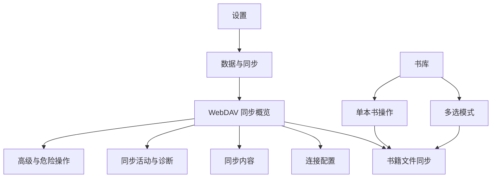

# WebDAV 同步 UI / UX 设计

> 状态：核心流程已实现，高级诊断与远端数据管理待后续
>
> 日期：2026-07-22
>
> 依赖：`DESIGN.md`、`docs/webdav-sync-design.md`

## 1. 体验目标

用户应当形成三个稳定认知：

1. 阅读进度、书签和笔记属于轻量同步，配置后基本不需要管理。
2. 书籍原文件可能很大，必须由用户决定哪些书上传、哪些书下载到当前设备。
3. WebDAV 是用户自己的远端空间；清除本机账号不会删除远端数据。

产品不追求让用户看见每一个网络请求，而是让用户随时回答四个问题：

- 现在连接正常吗？
- 最近一次成功同步是什么时候？
- 本机还有多少内容没有同步？
- 某本书的文件现在位于本机、远端，还是两边都有？

## 2. 信息架构



设置页管理同步系统，书库管理具体书籍。两处都可发起书籍上传/下载，但状态和任务由同一个同步控制器统一维护。

## 3. 全局状态模型

界面只暴露用户能理解并采取行动的状态：

| 状态 | 用户文案 | 主操作 |
| --- | --- | --- |
| 未配置 | 尚未设置 WebDAV | 设置 WebDAV |
| 测试中 | 正在检查连接与写入权限 | 取消 |
| 已就绪 | 已连接 · 刚刚同步 | 立即同步 |
| 有待同步内容 | 5 项变更等待同步 | 立即同步 |
| 同步中 | 正在同步书签与进度 | 查看详情 |
| 文件传输中 | 正在下载 2 本书 · 128 MB / 640 MB | 查看任务 |
| 离线 | 当前离线 · 变更已保存在本机 | 无强制操作 |
| 需要重新登录 | WebDAV 登录信息已失效 | 更新密码 |
| 部分失败 | 元数据已同步，1 本书下载失败 | 查看并重试 |
| 远端不兼容 | 此目录包含不支持的数据版本 | 更换目录 |

正常自动同步成功不弹 Toast。只有用户主动点击“立即同步”时才显示简短成功反馈；需要用户处理的失败使用页面内状态卡或持久提示，不使用一闪而过的错误。

## 4. 设置页入口

在现有设置页中，放在“内容来源”之后、“AI 助手”之前新增“数据与同步”卡片。

```text
┌ 数据与同步 ─────────────────────────┐
│ ☁ WebDAV 同步                       › │
│   未配置                              │
└──────────────────────────────────────┘
```

配置后副标题按优先级显示：

- 有错误：`登录信息已失效`
- 正在同步：`正在同步 3 项变更`
- 有待同步：`5 项等待同步`
- 正常：`上次同步：今天 15:32`

入口只展示一行摘要，不在设置首页堆叠开关、账号字段或传输进度。

## 5. WebDAV 同步概览页

### 5.1 手机布局

```text
┌──────────────────────────────────────┐
│ ‹  WebDAV 同步                  ⋮    │
├──────────────────────────────────────┤
│  ☁ 已连接                            │
│  dav.example.com / OpenReading       │
│  上次成功同步：今天 15:32             │
│  5 项等待上传 · 当前使用 Wi‑Fi        │
│                                      │
│  [ 立即同步 ]          [ 查看活动 ]   │
├──────────────────────────────────────┤
│ 自动同步                         开   │
│ 打开应用或回到前台时自动同步          │
├──────────────────────────────────────┤
│ 同步内容                             │
│ 阅读进度、书签、笔记、统计、阅读设置 ›│
├──────────────────────────────────────┤
│ 书籍文件                             │
│ 12 本已同步 · 36 本仅在远端           │
│ 远端约 3.2 GB                       ›│
├──────────────────────────────────────┤
│ 连接配置                             │
│ dav.example.com                     ›│
├──────────────────────────────────────┤
│ 安全提示                             │
│ 当前内容未启用端到端加密              │
└──────────────────────────────────────┘
```

顶部状态卡是视觉焦点，但不使用大面积鲜艳渐变。沿用当前设置页暖白/雾蓝卡片、低饱和边框和主题色主按钮。

### 5.2 状态卡行为

- 点击“立即同步”后按钮原位变为阶段文案和小型进度指示，不跳转页面。
- 同步元数据时使用不确定进度；传输书籍文件时显示确定进度和数量。
- 页面可退出，同步继续运行；返回后恢复真实状态。
- 同步过程中再次点击不启动第二个任务，改为进入“同步活动”。
- 右上角菜单只放低频操作：同步活动、重新测试连接、帮助。

### 5.3 宽屏布局

- 页面最大宽度约 1080px。
- 左侧 360px 固定展示连接状态、立即同步和安全提示。
- 右侧展示自动同步、同步内容、书籍文件和连接配置。
- 不把手机卡片简单拉宽；书籍文件详情使用表格或双栏列表。

## 6. 首次配置流程

首次配置使用四步全屏流程，手机不使用塞满输入框的长对话框；桌面端可使用最大宽度 640px 的模态页。

### 6.1 第一步：连接信息

字段顺序：

1. WebDAV 地址
2. 用户名
3. 应用密码
4. 远端目录（高级项，默认 `OpenReading`）

交互要求：

- 地址粘贴后自动去除首尾空格并规范末尾斜杠。
- 密码默认隐藏，显隐按钮有语义标签。
- HTTPS 地址正常显示；HTTP 地址不直接保存，而是显示风险说明和“仅允许私网测试”的高级入口。
- 主按钮为“测试连接”，不是“保存”。

示例文案：

> 建议使用服务商提供的应用专用密码。Open Reading 不会把密码上传到同步目录。

### 6.2 第二步：测试连接

测试过程逐项展示，不使用一个无限旋转直到超时的按钮：

```text
✓ 已连接服务器
✓ 登录成功
✓ 可以读取目录
✓ 可以创建和删除测试文件
✓ 服务器可以接收同步数据
```

若服务端支持 WebDAV quota，再额外显示可用空间；服务端不提供配额时不伪造“空间充足”结论。

失败时停在对应步骤并给出行动：

- 401/403：`用户名、密码或目录权限不正确` → 修改登录信息
- 404/409：`远端目录无法创建` → 修改目录
- TLS：`服务器证书无法验证` → 查看证书说明，不提供“一键忽略”
- 超时：`服务器暂时没有响应` → 重试

测试产生的临时文件必须自动清理。测试成功后主按钮变为“继续”。

### 6.3 第三步：选择同步内容

使用分组开关，不让用户理解数据库表：

```text
核心阅读数据
  阅读进度                         开
  书签、笔记与高亮                 开
  阅读统计                         开

阅读体验
  阅读器设置                       开
  书源列表                         开/待定

书籍文件
  上传书籍原文件                   关
  可能占用较多流量和远端空间
```

关闭某一数据域只停止之后的同步，不立即删除远端历史数据。用户若希望删除远端内容，需要去“远端数据管理”。

开启“上传书籍原文件”后不立即上传全部书籍，而是进入选书页。

### 6.4 第四步：首次同步方式

远端为空时：

> 将在 `OpenReading/v1` 创建同步空间，并上传本机的阅读数据。

远端已有数据时，先展示摘要：

```text
发现已有同步数据
2 台设备 · 48 本书 · 16 条笔记
最近更新：今天 14:08
```

选项：

- `合并本机与远端`：默认和推荐。
- `仅从远端恢复到本机`：本次不上传本机现有记录，恢复完成后回到正常双向同步。
- `用本机替换远端`：不在普通流程展示，只在高级危险操作中提供。

开始后进入概览页显示真实阶段。完成时显示一次结果摘要，不使用庆祝动画。

## 7. 同步内容页面

该页面只管理“哪些数据类型参与同步”，不管理具体书籍文件。

每项包含标题、影响说明、开关和可选详情：

- 阅读进度：`在其他设备继续上次阅读位置`
- 书签、笔记与高亮：`删除和修改也会同步`
- 阅读统计：`合并各设备产生的阅读记录`
- 阅读器设置：`同步字号、间距、主题和翻页设置`
- 应用外观：`语言和深浅色默认保留在当前设备`，默认关闭

改变开关后立即保存到本机；若会影响已有远端数据，显示一行非阻塞说明，不弹确认框。

## 8. 书籍文件同步页面

### 8.1 核心原则

- 元数据自动同步，书籍原文件按书选择。
- “是否上传”是书籍的同步策略；“是否下载”是当前设备的本地选择。
- 当前设备下载了哪些书，不同步到其他设备。
- “全部上传/全部下载”是批量操作，不是默认行为。

### 8.2 页面结构

顶部摘要：

```text
书籍文件
远端：12 本 · 1.4 GB
本机未上传：8 本 · 860 MB
远端未下载：36 本 · 3.2 GB
```

下方使用三段筛选：

- `待上传`
- `可下载`
- `已同步`

同时提供搜索和按大小、最近阅读、书名排序。

### 8.3 待上传列表

每一项显示：封面、书名、作者、格式、文件大小和选择框。

```text
☐  学习的逻辑
   PDF · 84 MB
   仅在本机

☑  都市古仙医
   EPUB · 6.8 MB
   将上传到 WebDAV
```

底部固定操作栏：

> 已选择 3 本 · 126 MB　　[上传所选]

提供“选择全部当前结果”，但不默认勾选全部。切换筛选或搜索时保留已选项目，并明确显示总选择数。

### 8.4 可下载列表

每项显示远端文件大小、当前阅读进度和来源设备，不展示远端内部哈希文件名。

操作方式：

- 单击行：进入书籍详情底部面板。
- 行尾下载按钮：直接加入下载队列。
- 长按/勾选：进入批量下载。
- 批量栏显示所需空间，并在空间不足时禁用下载按钮。

批量下载确认：

> 将下载 12 本书，共 1.8 GB。下载完成后约占用 2.0 GB 本机空间。

可选：`仅在 Wi‑Fi 下继续`，默认开启；没有网络状态能力时首版不展示该开关。

### 8.5 已同步列表

状态包括：

- 本机与远端都有
- 正在上传
- 正在下载
- 等待网络
- 传输失败
- 本机版本与远端不一致

内容寻址相同的文件不制造“保留哪一个”的冲突弹窗；哈希不同但元数据指向同一本书时，保留两个版本并要求用户选择，不静默覆盖。

## 9. 书库中的交互

同步能力应融入现有书库卡片，而不是要求用户总去设置页。

### 9.1 远端未下载书籍

沿用现有书库卡片，在标题附近增加低强调度的“云端”标签；阅读进度仍正常显示，卡片底部不再显示一个假的本地文件状态。

```text
┌──────────────────────────────────────┐
│ [封面]  学习的逻辑          [云端]   │
│         18% · 上次阅读于昨天         │
│         84 MB                        │
│                    [下载并阅读]       │
└──────────────────────────────────────┘
```

- 点击卡片：打开底部面板，而不是直接进入一个会失败的阅读器。
- 主操作：`下载并阅读`。
- 次操作：`仅下载`。
- 说明：`下载完成前，阅读进度和笔记仍会保留。`

下载完成后，如果用户选择“下载并阅读”且仍停留在应用内，自动进入阅读器；失败时留在书库并提供重试。

### 9.2 本机书籍

现有长按书籍操作面板增加：

- `上传到 WebDAV`
- `停止同步书籍文件`
- `从本机删除，保留远端文件`
- `从所有设备和远端删除`，危险操作

“停止同步书籍文件”不删除已经上传的远端文件，只停止该书后续自动上传。远端删除必须明确选择。

### 9.3 多选模式

书库长按进入多选后，底部操作栏根据选择状态显示：

- 上传所选
- 下载所选
- 从本机移除
- 更多

混合选择“本机书”和“云端书”时，主操作显示为“同步所选”，展开后分别说明将上传和下载多少本，避免一个按钮同时做未知方向的事情。

### 9.4 筛选

书库现有筛选菜单增加“文件状态”：

- 全部
- 本机可阅读
- 仅在远端
- 等待上传
- 传输失败

不新增顶层导航 Tab，避免书库被同步功能喧宾夺主。

## 10. 同步活动与下载队列

复用并扩展现有下载任务页面，使其同时展示 WebDAV 文件任务；元数据同步只保留最近记录，不作为长期任务占满列表。

分区：

- 进行中
- 等待中
- 最近完成
- 需要处理

任务行显示：

- 书名和方向图标（上传/下载）
- 已传输大小、总大小和速度
- 失败原因与重试
- 暂停/取消只作用于文件传输，不取消已经完成的元数据同步

取消下载时删除 `.part`；取消上传时保留本地书籍，远端临时文件交给清理机制。

## 11. 自动同步 UX

- 自动同步成功保持安静，只更新时间和待同步数量。
- 用户正在阅读时不显示同步浮层，也不因网络活动移动控制栏。
- 进度与笔记先本地保存；网络慢时不阻塞返回或翻页。
- 连续修改阅读进度只显示一项待同步记录，不显示几十个翻页事件。
- 文件自动传输与元数据自动同步分开控制。首版书籍文件不自动下载。
- 如果提供“自动上传新导入书籍”，默认关闭，并明确预计流量；设置应属于“书籍文件同步”页面。

## 12. 冲突 UX

大部分冲突自动处理，只在同步活动摘要中记录：

> 自动处理 1 项同时修改：保留了较新的阅读位置。

需要用户选择的情况仅限无法安全推断的文件版本：

```text
发现两个不同版本
《示例书》在本机与远端内容不同。

本机：EPUB · 8.2 MB · 今天 10:20
远端：EPUB · 7.9 MB · 昨天 21:14

[保留两个版本]
[使用本机版本]
[使用远端版本]
```

默认选择“保留两个版本”。阅读进度和笔记继续绑定各自内容身份，不能仅按书名粗暴合并。

## 13. 错误与恢复

错误采用“原因 + 当前影响 + 下一步”结构：

> 无法登录 WebDAV
>
> 本机阅读数据仍已保存，但暂时不能上传。
>
> [更新密码]

> 远端空间不足
>
> 阅读进度已经同步，2 本书籍文件未上传。
>
> [管理书籍文件] [重试]

> 同步数据损坏
>
> 已停止应用来自设备“Windows-PC”的第 42 批变更。其他数据未受影响。
>
> [复制诊断信息]

部分失败不能显示成整体“同步失败”。必须告诉用户哪些数据已经安全完成。

## 14. 危险操作

“高级与危险操作”独立成卡片，默认折叠或位于页面底部：

### 清除本机配置

文案：

> 删除当前设备保存的 WebDAV 地址和登录信息。不会删除书籍、阅读记录或远端数据。

### 重置本机同步状态

文案：

> 保留本机内容，但重新扫描所有远端变更。下次同步可能耗时较长。

### 删除远端 Open Reading 数据

必须展示服务器主机名、完整根目录、书籍数量和估计大小，并要求输入 `删除远端数据`。执行前关闭自动同步；部分删除失败时提供精确残留清单，不宣称删除成功。

## 15. 视觉规范

- 复用现有书库的大标题、暖白卡片、雾蓝背景和低饱和主题色。
- 同步页不使用科技感霓虹、云朵插画或大面积蓝色渐变。
- 正常状态使用中性色；只有主按钮和少量进度使用主题色。
- “云端”“在线”等标签沿用现有小型圆角胶囊，但必须区分：在线书源使用“在线”，WebDAV 未下载文件使用“云端”。
- 成功、警告、错误同时使用图标、文字和颜色。
- 卡片圆角、阴影和间距直接复用设置页与书库组件，不新增 WebDAV 专属 token。
- 文件大小、时间和速度使用等宽数字特性或 `tabularFigures`，减少进度更新时文字跳动。

## 16. 动效与反馈

- 页面切换沿用现有路由动效。
- 状态图标从空闲到同步使用 180–240ms 淡入/旋转过渡；减少动态效果时只替换静态图标。
- 文件进度条更新平滑但不伪造速度；未知总大小时使用不确定进度并显示已传输字节。
- 任务完成后进度条保持完成态约 600ms，再移动到“最近完成”，防止列表突然消失。
- 自动同步成功不震动；用户主动批量操作完成可以提供一次轻触觉反馈。

## 17. 无障碍与国际化

- 所有仅图标按钮提供 tooltip 和语义标签。
- 状态变化使用 live region，但进度播报节流，避免每个百分比打断屏幕阅读器。
- 选择框、封面和整行点击范围不能制造冲突；桌面端整行聚焦后空格切换选择，回车打开详情。
- 错误不依赖红色；文件状态不依赖云朵图标。
- 中文、繁中、英文、日文文案按 1.5 倍长度预留；按钮允许换行或扩展，不截断危险操作含义。
- 日期使用本地化相对时间，详情页可显示完整时间和时区。

## 18. 关键文案基线

| 场景 | 推荐文案 |
| --- | --- |
| 未配置 | 设置 WebDAV，在自己的远端空间同步阅读数据 |
| 正常 | 已连接 · 上次同步于今天 15:32 |
| 待同步 | 5 项变更等待同步 |
| 离线 | 当前离线，变更已保存在本机 |
| 首次合并 | 合并本机与远端，不会删除任何一侧的数据 |
| 文件开关 | 书籍原文件较大，请选择需要上传的书籍 |
| 云端书 | 文件尚未下载到本机 |
| 清除配置 | 只删除本机登录信息，不删除远端数据 |
| 非端到端加密 | 数据通过 HTTPS 传输，但 WebDAV 服务提供方仍可读取远端内容 |

避免使用：

- “云端已保存”：无法说明哪个数据域成功。
- “一键同步全部”：掩盖文件体积和方向。
- “清空云端”：对象和目录范围不明确。
- “智能解决冲突”：不能解释实际规则。

## 19. 页面验收标准

- 用户能在不阅读帮助文档的情况下完成首次配置和连接测试。
- 首次同步前明确知道书籍原文件不会默认上传。
- 用户能分别选择上传哪些本机书籍、下载哪些远端书籍。
- 书库中未下载书籍不会进入失败的阅读器页面。
- 自动同步成功不会频繁打扰；需要处理的错误不会因 Toast 消失而丢失。
- 所有页面都能区分元数据同步与文件传输。
- 离线、认证失效、空间不足和部分失败都有明确下一步。
- 手机 360px 宽度不横向溢出；宽屏不出现超过可读宽度的输入框和卡片。
- 桌面端可完全使用键盘完成配置、选书和重试。
- 删除远端数据无法通过一次误触完成。
